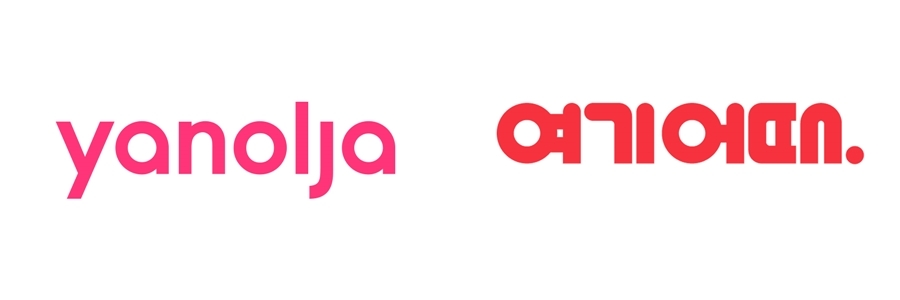
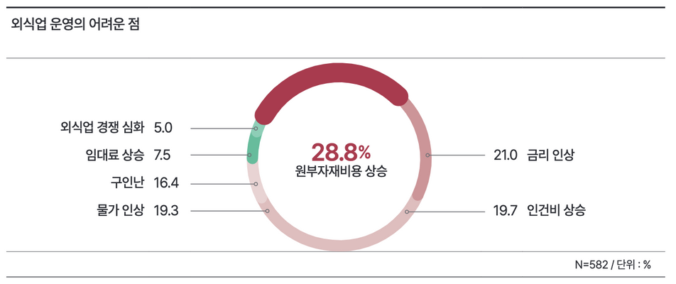
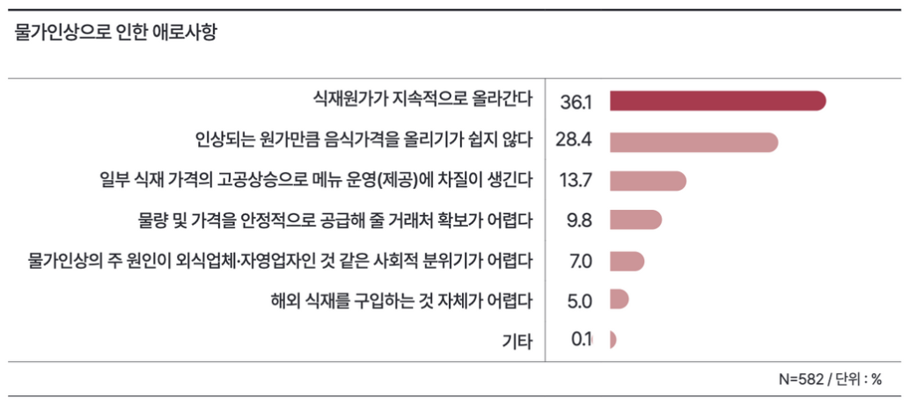
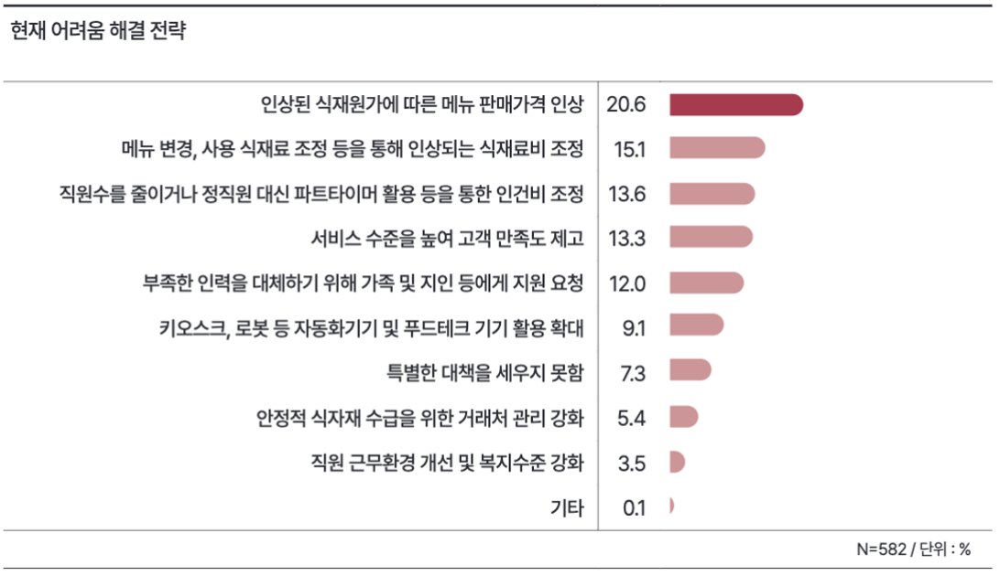

# Toxx_To_User
Toxx to users in a diner - 외식업 재고 소진 촉진 서비스

# IT서비스 기획 - 벤치마킹 제안서

생성일: 2023년 3월 21일 오후 5:23
태그: 기획

# *Toss to users in a diner* - 외식업 재고 소진 촉진 서비스

## *사장님, 오늘은 갈빗살이 빨리 나가야 하나요?! 토스하세요.*

**이 서비스는 Toss에 이미 존재하는 위치 기반 서비스에 실효성있는 기능을 더하기 위해 기획했습니다.**

- 야놀자, 여기어때 등 숙박업소 공실에 대한 정보와 할인 제공 서비스 아이디어를 활용합니다.
- ‘마감할인now’라는 서비스를 제공하는 라스트오더의 서비스를 참조하고 더욱 양질의 서비스를 제공합니다.

## 개요

코로나-19 시대의 종식과 함께 배달을 제외한 외식시장이 빠른 기세로 회복하고 있습니다. 우리는 외식업에서 점주가 느끼는 가장 큰 애로사항인 식재료비에 집중한 해결안을 *야놀자, 여기어때* 등의 숙박 업소 공실 관리 서비스를 벤치마킹하여 제안하고자 합니다. 

하나의 어플리케이션에서 다양한 기능을 제공하는 슈퍼앱인 *Toss*와 외식업을 대상으로 매장운영 솔루션을 제공하는 *Toss Place* 간의 정보를 연결하고, 그 안에서 전략적인 식재료 관리와 마케팅 효과를 일으키는 것이 목표입니다.

## 벤치마킹

---

**여기어때, 야놀자**

---

타겟 : OTA에서 다루고 있는 숙박업 공실 솔루션

서비스 : 지도를 통해 사용자 주변의 숙박업소 정보를 제공하고 있는 서비스

**라스트오더**

---

타겟 : 유사한 서비스

서비스 : 지도를 통해 사용자 주변의 제휴업체 마감 할인 정보를 제공하고 있는 서비스

### 기존 서비스의 개선 포인트

---

1. 현재 Toss 앱에서 제공하고 있는 위치기반 서비스는 만보기 및 특정장소 방문의 기능만 제공하고 있으며, Toss 앱 내 지도를 얼마나 많은 이용자가 사용하고 있는지 정확한 값은 알 수 없으나, 컨텐츠 부족으로 해당 페이지의 사용자 이탈 가능성이 높을 것으로 예측합니다.

2. Toss Place의 주요 고객은 외식업 종사자들이며, 솔루션을 통해 외식업 종사에서 겪는 애로사항을 해결하고자 합니다. 
 시장조사에 따르면 가장 큰 애로사항은 식재료에 관한 것으로, 이 비중은 전체 사례 수의 28.8%로 가장 높은 비중으로 나타나고 있습니다. 이 중 식재원가의 상승, 음식가격 조정, 일부 식재원가의 큰 변동이 주 애로사항이었으며, 이러한 부분에서 외식업의 식재 소비에 대한 전략적인 접근이 필요함을 예측합니다.
 현재 코로나-19 방역수칙이 해소됨에 따라 외식의 수요와 함께 식자재의 수요가 증가하고 있으며, 식자재의 비용이 큰 상태에서 사용하지 못하고 폐기되는 식자재에 대해 주목할 예정입니다.

    
    
    
    외식업 운영의 어려운 점 - 원형 그래프(*2022 국내외 외식트렌드, aT한국농수산식품유통공사*)
    
    
    
    물가인상으로 인한 애로사항 그래프(*2022 국내외 외식트렌드, aT한국농수산식품유통공사*)
    
    
    
    현재 어려움 해결 전략 그래프(*2022 국내외 외식트렌드, aT한국농수산식품유통공사*)
    
3. Toss 앱과 Toss Place 간에 제공하는 서비스는 현재 토스 결제 외엔 없습니다. 
벤치마킹을 통해 Toss와 Toss Place 간의 서비스 연결점을 만들어 Super App으로서의 역할을 추가합니다.

### 벤치마킹을 통한 개선의 이유

---

1. 숙박업은 기본적으로 공실이 발생하는 것에 대하여 순수한 영업상의 손실로 해석합니다.
2. 외식업에서도 이와 비슷하게 음식이 판매되지 못하고, 재료의 재고가 남아 유통기한이 지나면 공실과 비슷한 형태로 순수한 영업상의 손실로 해석됩니다.
3. 숙박업소의 공실을 줄이기 위해 객실 정보 제공 및 할인 서비스를 다루고 있는 대표적인 OTA(*Online Travel Agency*)기업인 야놀자와 여기어때의 주요 서비스를 벤치마킹 타겟으로 지정합니다.
4. 추가로 ‘*내 주변 마감할인now*’ 서비스를 제공하고 있는 라스트오더의 서비스와 차별점을 두기 위해 참조합니다.

### 벤치마킹 서비스 구현 방식

---

1. **서비스 플로우차트**

1. **서비스 예상 UI**

---

*TossPlace와 Toss의 UI를 기반으로 제작된 이미지입니다.*

**Toss Place POS SW view**

1. 점주 시점의 Toss Place POS SW 초기 UI

2. 더보기를 눌러 POS SW의 여러 기능을 확인할 수 있으며, 그 중 오늘의 메뉴 알리기 기능을 사용합니다.

3. 오늘의 메뉴 알리기 UI 블록이 나타나고, 목적에 맞추어 할인금액과 수량을 설정하고 알리기 버튼을 누릅니다.

4. 주변에 있는 손님에게 오늘의 메뉴를 알렸다는 피드백 메세지를 보여줍니다.

---

**Toss User View**

---

Toss 앱 내 만보기를 이용하고 있던 사용자는 주변에 있는 정보를 확인할 수 있습니다.

그 중 식기 아이콘을 눌러 오늘의 메뉴를 확인하게 됩니다. *오늘은 아보카도 샌드위치를 할인하고 있군요!*

### 경쟁 서비스(라스트오더) 강점 및 약점 분석

---

주요 경쟁 서비스

라스트오더 내 주변 목록 UI

라스트오더 내 주변 지도 UI

---

**라스트오더 서비스 UI**

- 라스트오더는 현재 마감할인now 서비스에 대해 목록형과 지도형 UI를 제공하고 있습니다.

**라스트오더의 장점**

- 국내 시장에서 마감할인 온라인 안내 서비스를 선점 운영
- 안내 서비스 외, 기한임박 상품을 다루는 이커머스 운영
- 상생과 환경적 기여로 사회적 기업 인식을 가짐
- 목록형을 이용한 이미지 중심의 정보 전달과 지도형을 이용한 사용자 중심 정보 전달

**라스트오더의 단점**

- 라스트오더 서비스의 트래픽이 빠르게 하락 중(고점 대비 81% 하락)
- 해당 서비스를 이용하려면 고객과 점주 모두 어플리케이션 설치 필요
- 점주 입장에서 주문 및 메뉴에 대한 관리 모두 어플리케이션을 통해 관리
- 주문이 들어온 상황에서, 어플리케이션 업데이트가 이루어지지 않았다면 주문 확인 불가
- 결론적으로 서비스 관리 미흡으로 빠른 사용자 이탈 중.

라스트오더 트래픽 그래프(안드로이드, iOS, MOB, PC)(혁신의 숲 제공, 2023)

애플 앱스토어 리뷰 캡쳐(2023.03)

Play 스토어 리뷰 캡쳐(2023.03)

### 경쟁 서비스 대비 강점 및 약점 분석

---

**토스에서 서비스했을 때 장점**

- Toss Place의 POS SW를 통해 점포에서 재고 소진 및 단가에 의해 전략적 소비가 필요한 특정 재고 
관리 가능
- 1500만의 이용자를 가진 Toss를 통해 절대적인 점유율에서 발생하는 점포 홍보효과를 누릴 수 있으며, 이를 통해 POS 업계의 자연스러운 지분 상승으로 이어질 수 있음을 기대
- Toss 이용자와 Toss Place 이용자 모두에게 지역 상생적 이익 제공 가능

**토스에서 서비스했을 때 단점**

- 점주는 Toss Place의 POS SW를 사용해야만 해당 서비스를 이용 가능(진입 비용이 앱 설치에 비해 더 큼)
- 얼마나 많은 이용자가 Toss의 지도 페이지를 이용하는지 확인할 수 없으며, 서비스 이용자를 대상으로 새로운 기능에 대한 홍보 필요

## 서비스 개선 결과 예측

---

이번 과제에서는 Toss Place POS SW를 통해 더욱 효율적인 재고 관리가 가능하고, Toss의 1500만 이용자를 통해 점포 홍보효과를 누릴 수 있다는 장점이 있습니다. 또한, Toss Place와 Toss 이용자 모두에게 지역 상생적 이익을 제공할 수 있습니다.

하지만, 점주가 Toss Place의 POS SW를 사용해야만 해당 서비스를 이용할 수 있으며, 얼마나 많은 이용자가 Toss의 지도 페이지를 이용하는지 확인할 수 없다는 단점이 있습니다. 이를 보완하기 위해서는 새로운 기능에 대한 홍보와 Toss Place 이용 촉진이 필요합니다.

서비스 개선 결과로는 점진적인 점유율 성장과 함께 더욱 많은 점포에서 해당 서비스를 이용할 것으로 예측되며, 이를 통해 더 많은 이용자들이 지역 상생적 이익을 누릴 수 있을 것입니다. 또한, Toss의 지도 페이지 이용률이 높아질 것으로 기대됩니다.

**POS 시장 측면 예측**

전 세계 POS 단말기 시장은 2019년 76억 2,000만 달러에서 연평균 성장률 8.62%로 증가하여, 2024년에는 115억 2,000만 달러에 이를 것으로 전망하고 있습니다.

**글로벌 POS 단말기 시장 규모 및 전망** (연구개발특구진흥재단 재해석,TechNavio, Global POS Terminals Market, 2020)

기존 POS 업계의 기술적 방향으로는 내구성, 보안성, 클라우드 등 POS 고유 기능에 집중하고 있습니다. 이와 달리 Toss Place의 POS SW로부터 Toss 앱까지의 연결성을 가지고 서비스 영역의 확대를 이룬다면, POS 단말기 시장에서의 새로운 도전이 될 수 있으며, Toss의 사용자로부터 많은 인지도와 인식을 얻을 수 있을 것입니다.

더 나아가 핀테크 기업으로서 Toss와 Toss Place의 POS SW의 글로벌 마켓 진출을 기대할 수 있습니다.

## 평가 계획 및 KPI 모니터링 계획

---

서비스에 대한 평가 계획과 KPI 모니터링 계획은 다음과 같습니다.

**평가 계획**

- 서비스 이용자와 미이용자 간의 설문조사를 통해 서비스 개선점 파악
- 점포 연간 매출 증가율 비교를 통한 서비스 영향력 분석
- 지역 상생적 이익 제공 비율 측정

**KPI 모니터링 계획**

- Toss Place POS SW 이용률 모니터링
- Toss 지도 페이지 이용률 모니터링
- Toss Place 결제 단말기 이용자 수 모니터링
- 홍보 상품 이용자 수 및 이용률 모니터링

위의 평가 계획과 KPI 모니터링 계획을 기반으로, 서비스 개선과 성장을 지속적으로 모니터링하며 최적의 결과를 도출하도록 노력할 것입니다.

## 요약

---

이 문서는 STARTERS 취업 부트캠프 5기<IT 서비스 기획>를 위해 작성한 문서로, Toss 앱과 경쟁 서비스인 라스트오더에 대한 분석과 Toss Place 서비스의 개선 결과 예측, 평가 계획 및 KPI 모니터링 계획 등 다양한 내용이 담겨 있습니다.

원론적으로 야놀자 및 여기어때와 같은 OTA 서비스의 공실 관리 솔루션을 기반으로 시작하였으며, 경쟁 서비스인 라스트오더의 강점 및 약점 분석을 통해 벤치마킹 기획의 보충을 이루었습니다. 

라스트오더는 국내 시장에서 마감할인 온라인 안내 서비스를 선점하고 있으며, 목록형과 지도형 UI를 모두 제공하는 등 정보 전달 방식에 대한 선택지가 다양합니다. 하지만, 서비스의 트래픽이 하락하고 있으며, 어플리케이션 업데이트가 이루어지지 않을 경우 주문 확인이 어려운 등 서비스 관리 측면에서 미흡한 점이 있습니다.

Toss는 기존 서비스 범위 안에서 POS SW를 통해 점포에서 재고 관리 및 전략적 소비가 가능한 장점이 있습니다. 또한, 1500만의 이용자를 보유한 Toss를 통해 큰 마케팅 효과를 누릴 수 있으며, 이를 통해 POS 분야의 자연스러운 지분 상승으로 이어질 것으로 예측됩니다. 반면, Toss 앱을 사용하려면 POS SW를 설치해야 하는 단점과 지도 페이지 이용률 측정이 어렵다는 단점도 있습니다.

이 서비스는 추후 새로운 기능에 대한 홍보와 Toss Place 이용 촉진이 필요하며, 평가 계획과 KPI 모니터링 계획을 통해 서비스 개선과 성장을 지속적으로 모니터링하며 최적의 결과를 도출할 예정입니다.

이상 <***Toss to users in a diner* - 외식업 재고 소진 촉진 서비스**> 벤치마킹 기획안이었습니다.

감사합니다.

> <***Toss to users in a diner* - 외식업 재고 소진 촉진 서비스**>
> 

> 마지막 수정일 : 2023.03.20
> 

> 작성자 : 김윤수
> 

> 원본 웹 링크 : [https://simplistic-princess-34d.notion.site/_STARTERS-5-IT-61bbb83efdd94e55954e9da678982cd6](https://www.notion.so/IT-61bbb83efdd94e55954e9da678982cd6)
>
